<!-- ARCHITECTURE SNAPSHOT — generated 2026-05-29 15:54 | master@50f5551 -->
<!-- DO NOT EDIT MANUALLY — run scripts/update-architecture.ps1 to refresh -->

# Sitefinity CLI — Architecture

> **Generated:** 2026-05-29 15:54
> **Branch / commit:** `master` @ `50f5551`
> **Refresh script:** [`scripts/update-architecture.ps1`](../scripts/update-architecture.ps1)

---

## 1. Overview

`sf` (Sitefinity CLI) is a **.NET 9 console application** built on
[McMaster.Extensions.CommandLineUtils](https://github.com/natemcmaster/CommandLineUtils)
and the generic `Microsoft.Extensions.Hosting` host. It exposes sub-commands
to create, upgrade, migrate, and manage Sitefinity CMS projects.

`
sf
├── add          – scaffold resources into an existing project
├── install      – install Sitefinity NuGet packages
├── upgrade      – upgrade Sitefinity packages in a solution
├── create       – create a brand-new Sitefinity project
├── generate-config – generate a CLI config file
├── migrate      – migrate Web Forms / MVC pages to ASP.NET Core or Next.js
└── version      – print CLI version
`

---

## 2. Solution Layout

`
Sitefinity-CLI/
├── Sitefinity CLI/           ← main application project (net9.0-windows)
│   ├── Program.cs            ← entry point, DI wiring, host configuration
│   ├── Constants.cs          ← all string constants
│   ├── Commands/             ← CLI sub-command implementations
│   ├── Services/             ← domain service layer
│   ├── PackageManagement/    ← NuGet / dotnet-CLI operations
│   ├── Migrations/           ← widget / page migration logic
│   ├── VisualStudio/         ← .sln / .csproj file editors, VS worker
│   ├── Model/                ← plain DTOs
│   ├── Enums/
│   ├── Exceptions/
│   └── Logging/
└── Sitefinity CLI.Tests/     ← xUnit test project (net9.0-windows)
`

---

## 3. Architecture Diagram (Mermaid)

```mermaid
graph TD
    subgraph Entry["Entry Point"]
        PROG[Program.cs]
    end
    subgraph Commands["Commands Layer"]
        direction TB
        CMD_LIST["  Commands/AddCommand\n  Commands/AddCustomWidgetCommand\n  Commands/AddGridWidgetCommand\n  Commands/AddIntegrationTestsCommand\n  Commands/AddModuleCommand\n  Commands/AddPageTemplateCommand\n  Commands/AddResourcePackageCommand\n  Commands/AddToProjectCommandBase\n  Commands/AddToResourcePackageCommand\n  Commands/AddToSolutionCommandBase\n  Commands/CommandBase\n  Commands/ConfigAttribute\n  Commands/CreateCommand\n  Commands/GenerateConfigCommand\n  Commands/InstallCommand\n  Commands/MigrateCommand\n  Commands/UpgradeCommand\n  Commands/UpgradeVersionValidator\n  Commands/VersionCommand"]
    end
    subgraph Services["Services Layer"]
        SVC_LIST["  Services/ISitefinityConfigService\n  Services/ISitefinityNugetPackageService\n  Services/ISitefinityProjectService\n  Services/IVisualStudioService\n  Services/SitefinityConfigService\n  Services/SitefinityNugetPackageService\n  Services/SitefinityProjectService\n  Services/VisualStudioService"]
    end
    subgraph PackageMgmt["Package Management"]
        PKG_LIST["  PackageManagement/AssemblyReference\n  PackageManagement/DotnetCliClient\n  PackageManagement/IDotnetCliClient\n  PackageManagement/INuGetApiClient\n  PackageManagement/INuGetCliClient\n  PackageManagement/INuGetDependencyParser\n  PackageManagement/INugetProvider\n  PackageManagement/IPackagesConfigFileEditor\n  PackageManagement/ISitefinityPackageManager\n  PackageManagement/IUpgradeConfigGenerator\n  PackageManagement/IVisualStudioWorker\n  PackageManagement/IVisualStudioWorkerFactory\n  PackageManagement/NuGetApiClient\n  PackageManagement/NuGetCliClient\n  PackageManagement/NuGetPackage\n  PackageManagement/NuGetV2DependencyParser\n  PackageManagement/NuGetV2Provider\n  PackageManagement/NuGetV3DependencyParser\n  PackageManagement/NuGetV3Provider\n  PackageManagement/PackagesConfigFileEditor\n  PackageManagement/SitefinityPackageManager\n  PackageManagement/UpgradeConfigGenerator\n  PackageManagement/VisualStudioWorker\n  PackageManagement/VisualStuidoWorkerFactory"]
    end
    subgraph Migrations["Migrations"]
        MIG_LIST["  Migrations/BreadcrumbWidget\n  Migrations/BreadcrumbWidget\n  Migrations/ChangePasswordWidget\n  Migrations/Checkboxes\n  Migrations/Checkboxes\n  Migrations/Condition\n  Migrations/ContentWidget\n  Migrations/ContentWidget\n  Migrations/DocumentListWidget\n  Migrations/DocumentListWidget\n  Migrations/DocumentWidget\n  Migrations/DocumentWidget\n  Migrations/Dropdown\n  Migrations/Dropdown\n  Migrations/FacetsWidget\n  Migrations/FieldMapping\n  Migrations/File\n  Migrations/File\n  Migrations/FormMigrationBase\n  Migrations/FormMigrationBase\n  Migrations/FormPlaceholderWidget\n  Migrations/FormWidget\n  Migrations/FormWidget\n  Migrations/ImageWidget\n  Migrations/ImageWidget\n  Migrations/InstructionalText\n  Migrations/LanguageSelectorWidget\n  Migrations/LanguageSelectorWidget\n  Migrations/LayoutMigration\n  Migrations/LoginWidget\n  Migrations/LoginWidget\n  Migrations/MigrationBase\n  Migrations/MultipleChoice\n  Migrations/MultipleChoice\n  Migrations/NativeChatWidget\n  Migrations/NavigationWidget\n  Migrations/NavigationWidget\n  Migrations/Paragraph\n  Migrations/Paragraph\n  Migrations/PlaceholderWidget\n  Migrations/ProfileWidget\n  Migrations/ProfileWidget\n  Migrations/Provider\n  Migrations/QueryData\n  Migrations/QueryItem\n  Migrations/RecommendationsWidget\n  Migrations/RegistrationWidget\n  Migrations/RegistrationWidget\n  Migrations/SearchBoxWidget\n  Migrations/SearchResultsWidget\n  Migrations/SearchResultsWidget\n  Migrations/SearchWidget\n  Migrations/SectionHeader\n  Migrations/SectionHeader\n  Migrations/SubmitButton\n  Migrations/SubmitButton\n  Migrations/TaxonomyWidget\n  Migrations/TaxonomyWidget\n  Migrations/TextBox\n  Migrations/TextBox\n  Migrations/WidgetMigrationDefaults"]
    end
    subgraph VSLayer["VisualStudio / File"]
        VS_LIST["  VisualStudio/AssemblyInfo\n  VisualStudio/CsProjectFileEditor\n  VisualStudio/CsProjectFileReference\n  VisualStudio/ICsProjectFileEditor\n  VisualStudio/IProjectConfigFileEditor\n  VisualStudio/ISolutionProject\n  VisualStudio/Program\n  VisualStudio/ProjectConfigFileEditor\n  VisualStudio/SlnSolutionProject\n  VisualStudio/SlnxSolutionProject\n  VisualStudio/SolutionFileEditor\n  VisualStudio/SolutionProjectType"]
    end

    PROG --> Commands
    Commands --> Services
    Commands --> PackageMgmt
    Commands --> Migrations
    Services --> PackageMgmt
    Services --> VSLayer
    PackageMgmt --> VSLayer
```



---

## 4. Commands (19 total)

| Class | Subsystem |
|---|---|
| `Commands/AddCommand` | Commands |
| `Commands/AddCustomWidgetCommand` | Commands |
| `Commands/AddGridWidgetCommand` | Commands |
| `Commands/AddIntegrationTestsCommand` | Commands |
| `Commands/AddModuleCommand` | Commands |
| `Commands/AddPageTemplateCommand` | Commands |
| `Commands/AddResourcePackageCommand` | Commands |
| `Commands/AddToProjectCommandBase` | Commands |
| `Commands/AddToResourcePackageCommand` | Commands |
| `Commands/AddToSolutionCommandBase` | Commands |
| `Commands/CommandBase` | Commands |
| `Commands/ConfigAttribute` | Commands |
| `Commands/CreateCommand` | Commands |
| `Commands/GenerateConfigCommand` | Commands |
| `Commands/InstallCommand` | Commands |
| `Commands/MigrateCommand` | Commands |
| `Commands/UpgradeCommand` | Commands |
| `Commands/UpgradeVersionValidator` | Commands |
| `Commands/VersionCommand` | Commands |

---

## 5. Services (8 total)

| Class | Subsystem |
|---|---|
| `Services/ISitefinityConfigService` | Services |
| `Services/ISitefinityNugetPackageService` | Services |
| `Services/ISitefinityProjectService` | Services |
| `Services/IVisualStudioService` | Services |
| `Services/SitefinityConfigService` | Services |
| `Services/SitefinityNugetPackageService` | Services |
| `Services/SitefinityProjectService` | Services |
| `Services/VisualStudioService` | Services |

---

## 6. Package Management (24 total)

| Class | Subsystem |
|---|---|
| `PackageManagement/AssemblyReference` | PackageManagement |
| `PackageManagement/DotnetCliClient` | PackageManagement |
| `PackageManagement/IDotnetCliClient` | PackageManagement |
| `PackageManagement/INuGetApiClient` | PackageManagement |
| `PackageManagement/INuGetCliClient` | PackageManagement |
| `PackageManagement/INuGetDependencyParser` | PackageManagement |
| `PackageManagement/INugetProvider` | PackageManagement |
| `PackageManagement/IPackagesConfigFileEditor` | PackageManagement |
| `PackageManagement/ISitefinityPackageManager` | PackageManagement |
| `PackageManagement/IUpgradeConfigGenerator` | PackageManagement |
| `PackageManagement/IVisualStudioWorker` | PackageManagement |
| `PackageManagement/IVisualStudioWorkerFactory` | PackageManagement |
| `PackageManagement/NuGetApiClient` | PackageManagement |
| `PackageManagement/NuGetCliClient` | PackageManagement |
| `PackageManagement/NuGetPackage` | PackageManagement |
| `PackageManagement/NuGetV2DependencyParser` | PackageManagement |
| `PackageManagement/NuGetV2Provider` | PackageManagement |
| `PackageManagement/NuGetV3DependencyParser` | PackageManagement |
| `PackageManagement/NuGetV3Provider` | PackageManagement |
| `PackageManagement/PackagesConfigFileEditor` | PackageManagement |
| `PackageManagement/SitefinityPackageManager` | PackageManagement |
| `PackageManagement/UpgradeConfigGenerator` | PackageManagement |
| `PackageManagement/VisualStudioWorker` | PackageManagement |
| `PackageManagement/VisualStuidoWorkerFactory` | PackageManagement |

---

## 7. Migrations (61 total)

| Class | Subsystem |
|---|---|
| `Migrations/BreadcrumbWidget` | Migrations |
| `Migrations/BreadcrumbWidget` | Migrations |
| `Migrations/ChangePasswordWidget` | Migrations |
| `Migrations/Checkboxes` | Migrations |
| `Migrations/Checkboxes` | Migrations |
| `Migrations/Condition` | Migrations |
| `Migrations/ContentWidget` | Migrations |
| `Migrations/ContentWidget` | Migrations |
| `Migrations/DocumentListWidget` | Migrations |
| `Migrations/DocumentListWidget` | Migrations |
| `Migrations/DocumentWidget` | Migrations |
| `Migrations/DocumentWidget` | Migrations |
| `Migrations/Dropdown` | Migrations |
| `Migrations/Dropdown` | Migrations |
| `Migrations/FacetsWidget` | Migrations |
| `Migrations/FieldMapping` | Migrations |
| `Migrations/File` | Migrations |
| `Migrations/File` | Migrations |
| `Migrations/FormMigrationBase` | Migrations |
| `Migrations/FormMigrationBase` | Migrations |
| `Migrations/FormPlaceholderWidget` | Migrations |
| `Migrations/FormWidget` | Migrations |
| `Migrations/FormWidget` | Migrations |
| `Migrations/ImageWidget` | Migrations |
| `Migrations/ImageWidget` | Migrations |
| `Migrations/InstructionalText` | Migrations |
| `Migrations/LanguageSelectorWidget` | Migrations |
| `Migrations/LanguageSelectorWidget` | Migrations |
| `Migrations/LayoutMigration` | Migrations |
| `Migrations/LoginWidget` | Migrations |
| `Migrations/LoginWidget` | Migrations |
| `Migrations/MigrationBase` | Migrations |
| `Migrations/MultipleChoice` | Migrations |
| `Migrations/MultipleChoice` | Migrations |
| `Migrations/NativeChatWidget` | Migrations |
| `Migrations/NavigationWidget` | Migrations |
| `Migrations/NavigationWidget` | Migrations |
| `Migrations/Paragraph` | Migrations |
| `Migrations/Paragraph` | Migrations |
| `Migrations/PlaceholderWidget` | Migrations |
| `Migrations/ProfileWidget` | Migrations |
| `Migrations/ProfileWidget` | Migrations |
| `Migrations/Provider` | Migrations |
| `Migrations/QueryData` | Migrations |
| `Migrations/QueryItem` | Migrations |
| `Migrations/RecommendationsWidget` | Migrations |
| `Migrations/RegistrationWidget` | Migrations |
| `Migrations/RegistrationWidget` | Migrations |
| `Migrations/SearchBoxWidget` | Migrations |
| `Migrations/SearchResultsWidget` | Migrations |
| `Migrations/SearchResultsWidget` | Migrations |
| `Migrations/SearchWidget` | Migrations |
| `Migrations/SectionHeader` | Migrations |
| `Migrations/SectionHeader` | Migrations |
| `Migrations/SubmitButton` | Migrations |
| `Migrations/SubmitButton` | Migrations |
| `Migrations/TaxonomyWidget` | Migrations |
| `Migrations/TaxonomyWidget` | Migrations |
| `Migrations/TextBox` | Migrations |
| `Migrations/TextBox` | Migrations |
| `Migrations/WidgetMigrationDefaults` | Migrations |

---

## 8. VisualStudio / File Layer (12 total)

| Class | Subsystem |
|---|---|
| `VisualStudio/AssemblyInfo` | VisualStudio |
| `VisualStudio/CsProjectFileEditor` | VisualStudio |
| `VisualStudio/CsProjectFileReference` | VisualStudio |
| `VisualStudio/ICsProjectFileEditor` | VisualStudio |
| `VisualStudio/IProjectConfigFileEditor` | VisualStudio |
| `VisualStudio/ISolutionProject` | VisualStudio |
| `VisualStudio/Program` | VisualStudio |
| `VisualStudio/ProjectConfigFileEditor` | VisualStudio |
| `VisualStudio/SlnSolutionProject` | VisualStudio |
| `VisualStudio/SlnxSolutionProject` | VisualStudio |
| `VisualStudio/SolutionFileEditor` | VisualStudio |
| `VisualStudio/SolutionProjectType` | VisualStudio |

---

## 9. Models / DTOs (9 total)

| Class | Subsystem |
|---|---|
| `Model/CommandModel` | Model |
| `Model/DeprecatedPackage` | Model |
| `Model/DotnetPackageSearchResponseModel` | Model |
| `Model/FileModel` | Model |
| `Model/InstallNugetPackageOptions` | Model |
| `Model/OptionModel` | Model |
| `Model/PackageSpecificationResponseModel` | Model |
| `Model/PackageXmlDocumentModel` | Model |
| `Model/UpgradeOptions` | Model |

---

## 10. DI Registrations (from Program.cs)

```csharp
services.AddHttpClient();
services.AddScoped<ISitefinityNugetPackageService, SitefinityNugetPackageService>();
services.AddScoped<ISitefinityPackageManager, SitefinityPackageManager>();
services.AddScoped<IVisualStudioWorker, VisualStudioWorker>();
services.AddSingleton<IPromptService, PromptService>();
services.AddSingleton<IVisualStudioService, VisualStudioService>();
services.AddSingleton<IVisualStudioWorkerFactory, VisualStuidoWorkerFactory>();
services.AddTransient<ICsProjectFileEditor, CsProjectFileEditor>();
services.AddTransient<IDotnetCliClient, DotnetCliClient>();
services.AddTransient<INuGetApiClient, NuGetApiClient>();
services.AddTransient<INuGetCliClient, NuGetCliClient>();
services.AddTransient<INuGetDependencyParser, NuGetV2DependencyParser>();
services.AddTransient<INuGetDependencyParser, NuGetV3DependencyParser>();
services.AddTransient<INugetProvider, NuGetV2Provider>();
services.AddTransient<INugetProvider, NuGetV3Provider>();
services.AddTransient<IPackagesConfigFileEditor, PackagesConfigFileEditor>();
services.AddTransient<IProjectConfigFileEditor, ProjectConfigFileEditor>();
services.AddTransient<ISitefinityConfigService, SitefinityConfigService>();
services.AddTransient<ISitefinityNugetPackageService, SitefinityNugetPackageService>();
services.AddTransient<ISitefinityProjectService, SitefinityProjectService>();
services.AddTransient<IUpgradeConfigGenerator, UpgradeConfigGenerator>();
```

---

*Refresh: `.\scripts\update-architecture.ps1`*
