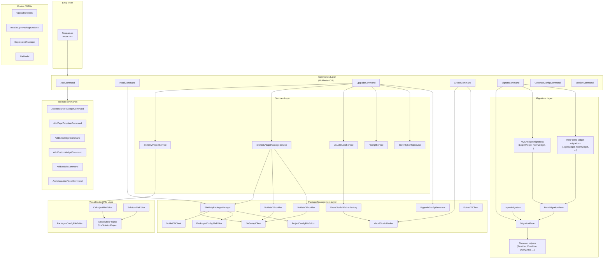

# Sitefinity CLI — Architecture

> **Generated:** 2025-01-23  
> **Version snapshot:** `master` branch  
> **Refresh script:** [`scripts/update-architecture.ps1`](../scripts/update-architecture.ps1)

---

## 1. Overview

`sf` (Sitefinity CLI) is a **.NET 9 console application** built on top of
[McMaster.Extensions.CommandLineUtils](https://github.com/natemcmaster/CommandLineUtils)
and the generic `Microsoft.Extensions.Hosting` host. It provides a set of
sub-commands that help developers create, upgrade, migrate, and manage
Sitefinity CMS projects from the command line.

```
sf
├── add          – scaffold resources into an existing project
├── install      – install the Sitefinity NuGet packages
├── upgrade      – upgrade Sitefinity packages in a solution
├── create       – create a brand-new Sitefinity project
├── generate-config – generate a CLI config file
├── migrate      – migrate Web Forms / MVC pages to ASP.NET Core or Next.js
└── version      – print CLI version
```

---

## 2. Solution Layout

```
Sitefinity-CLI/
├── Sitefinity CLI/           ← main application project (net9.0-windows)
│   ├── Program.cs            ← entry point, DI wiring, host configuration
│   ├── Constants.cs          ← all string constants (commands, messages, paths)
│   ├── Utils.cs              ← console/colour helpers
│   ├── PromptService.cs      ← user-prompt abstraction
│   ├── Commands/             ← CLI sub-command implementations
│   ├── Services/             ← domain service layer (contracts + implementations)
│   ├── PackageManagement/    ← NuGet / dotnet-CLI package operations
│   ├── Migrations/           ← widget / page migration logic
│   ├── VisualStudio/         ← .sln / .csproj file editors, VS worker
│   ├── Model/                ← plain data-transfer objects
│   ├── Enums/                ← enumerations (ExitCode, ProtocolVersion)
│   ├── Exceptions/           ← domain-specific exception types
│   └── Logging/              ← custom console formatter
└── Sitefinity CLI.Tests/     ← xUnit test project (net9.0-windows)
    ├── AddTests.cs
    ├── CreateCommandTests/
    ├── UpgradeCommandTests/
    ├── SolutionFileEditorTests/
    └── CsProjectFileEditorTests/
```

---

## 3. Architecture Diagram (Mermaid)



---

## 4. Subsystem Descriptions

### 4.1 Commands Layer (`Commands/`)

| File | Command | Purpose |
|---|---|---|
| `AddCommand.cs` | `sf add` | Groups all scaffold sub-commands |
| `AddResourcePackageCommand.cs` | `sf add resource-package` | Scaffold a resource package |
| `AddPageTemplateCommand.cs` | `sf add page-template` | Add a page template |
| `AddGridWidgetCommand.cs` | `sf add grid-widget` | Add a grid widget |
| `AddCustomWidgetCommand.cs` | `sf add custom-widget` | Add a custom MVC widget |
| `AddModuleCommand.cs` | `sf add module` | Add a Sitefinity module |
| `AddIntegrationTestsCommand.cs` | `sf add integration-tests` | Scaffold integration tests |
| `InstallCommand.cs` | `sf install` | Install Sitefinity NuGet packages |
| `UpgradeCommand.cs` | `sf upgrade` | Upgrade packages in a `.sln`/`.csproj` |
| `CreateCommand.cs` | `sf create` | Create a new Sitefinity project |
| `MigrateCommand.cs` | `sf migrate` | Migrate pages/templates to ASP.NET Core or Next.js |
| `GenerateConfigCommand.cs` | `sf generate-config` | Generate a CLI config JSON file |
| `VersionCommand.cs` | `sf version` | Print CLI version |

**Base classes:** `CommandBase`, `AddToProjectCommandBase`, `AddToSolutionCommandBase`, `AddToResourcePackageCommand`.

### 4.2 Services Layer (`Services/`)

| Contract | Implementation | Responsibility |
|---|---|---|
| `ISitefinityProjectService` | `SitefinityProjectService` | Read Sitefinity version from `.csproj`; enumerate projects in solution |
| `ISitefinityNugetPackageService` | `SitefinityNugetPackageService` | Find/resolve Sitefinity NuGet packages and their dependencies |
| `ISitefinityConfigService` | `SitefinityConfigService` | Read/write CLI config files |
| `IVisualStudioService` | `VisualStudioService` | Orchestrate VS automation (PowerShell Updater.ps1) via `IVisualStudioWorker` |
| `IPromptService` | `PromptService` | Interactive user prompts |

### 4.3 Package Management Layer (`PackageManagement/`)

| Class | Role |
|---|---|
| `SitefinityPackageManager` | Top-level façade: install/upgrade/restore NuGet packages |
| `NuGetV2Provider` / `NuGetV3Provider` | Fetch package metadata from NuGet v2 / v3 feeds |
| `NuGetV2DependencyParser` / `NuGetV3DependencyParser` | Parse dependency trees |
| `NuGetApiClient` | HTTP calls to NuGet REST API |
| `NuGetCliClient` | Shell-out to `nuget.exe` |
| `DotnetCliClient` | Shell-out to `dotnet` CLI |
| `PackagesConfigFileEditor` | Read/write legacy `packages.config` |
| `ProjectConfigFileEditor` | Read/write `<PackageReference>` in SDK-style `.csproj` |
| `UpgradeConfigGenerator` | Generate upgrade configuration JSON |
| `VisualStudioWorker` | COM/DTE-based Visual Studio automation |
| `VisualStudioWorkerFactory` | Factory that creates `IVisualStudioWorker` instances |

### 4.4 Migrations Layer (`Migrations/`)

Implements the `sf migrate` command logic using the external
`Progress.Sitefinity.MigrationTool.Core` SDK.

```
Migrations/
├── MigrationBase.cs             ← abstract base: property processing, REST SDK helpers
├── FormMigrationBase.cs         ← base for form-widget migrations
├── FormPlaceholderWidget.cs
├── PlaceholderWidget.cs
├── WidgetMigrationDefaults.cs
├── Common/                      ← Provider, Condition, QueryData, QueryItem, FieldMapping
├── WebForms/                    ← one class per legacy Web Forms widget
│   ├── Forms/                   ← form field widgets (TextBox, Dropdown, Checkboxes, …)
│   └── …
└── Mvc/                         ← one class per legacy MVC widget
    ├── Forms/                   ← form field widgets
    ├── LayoutMigration.cs
    └── …
```

### 4.5 VisualStudio / File Layer (`VisualStudio/`)

| Class | Responsibility |
|---|---|
| `SolutionFileEditor` | Parse `.sln` / `.slnx` files, enumerate projects |
| `CsProjectFileEditor` | Read/write assembly references, `<PackageReference>` nodes |
| `ProjectConfigFileEditor` | Manage `<PackageReference>` items in SDK projects |
| `PackagesConfigFileEditor` | Manage `packages.config` entries |
| `SlnSolutionProject` / `SlnxSolutionProject` | Model for a project entry inside a solution file |

### 4.6 Model / DTOs (`Model/`)

Pure data classes with no behaviour: `UpgradeOptions`, `InstallNugetPackageOptions`,
`DeprecatedPackage`, `FileModel`, `OptionModel`, `CommandModel`,
`PackageXmlDocumentModel`, `DotnetPackageSearchResponseModel`, etc.

---

## 5. Dependency Injection Wiring (summary from `Program.cs`)

| Interface | Implementation | Lifetime |
|---|---|---|
| `ICsProjectFileEditor` | `CsProjectFileEditor` | Transient |
| `ISitefinityProjectService` | `SitefinityProjectService` | Transient |
| `INuGetDependencyParser` | `NuGetV2DependencyParser`, `NuGetV3DependencyParser` | Transient |
| `INugetProvider` | `NuGetV2Provider`, `NuGetV3Provider` | Transient |
| `INuGetApiClient` | `NuGetApiClient` | Transient |
| `INuGetCliClient` | `NuGetCliClient` | Transient |
| `IDotnetCliClient` | `DotnetCliClient` | Transient |
| `IPackagesConfigFileEditor` | `PackagesConfigFileEditor` | Transient |
| `IProjectConfigFileEditor` | `ProjectConfigFileEditor` | Transient |
| `IUpgradeConfigGenerator` | `UpgradeConfigGenerator` | Transient |
| `ISitefinityConfigService` | `SitefinityConfigService` | Transient |
| `ISitefinityNugetPackageService` | `SitefinityNugetPackageService` | Scoped |
| `ISitefinityPackageManager` | `SitefinityPackageManager` | Scoped |
| `IVisualStudioWorker` | `VisualStudioWorker` | Scoped |
| `IVisualStudioService` | `VisualStudioService` | Singleton |
| `IPromptService` | `PromptService` | Singleton |
| `IVisualStudioWorkerFactory` | `VisualStudioWorkerFactory` | Singleton |

---

## 6. Key External Dependencies

| Package | Purpose |
|---|---|
| `McMaster.Extensions.CommandLineUtils` | Command-line parsing and sub-commands |
| `Microsoft.Extensions.Hosting` | Generic host, DI, logging |
| `NuGet.Configuration` / `NuGet.Protocol` | NuGet source / package handling |
| `Newtonsoft.Json` | JSON serialisation |
| `HandlebarsDotNet` | Templating for scaffolded files |
| `Progress.Sitefinity.MigrationTool.Core` | Widget migration engine |
| `Progress.Sitefinity.RestSdk` | Sitefinity REST API client (used in migrations) |
| `EnvDTE` / `EnvDTE80` | Visual Studio COM automation |

---

## 7. Data-Flow: `sf upgrade`

```
User
  │  sf upgrade <solution> <version>
  ▼
UpgradeCommand
  ├─► SitefinityProjectService  (detect current SF version)
  ├─► SitefinityNugetPackageService (resolve target packages + deps)
  ├─► PromptService  (licence acceptance)
  ├─► UpgradeConfigGenerator  (write upgrade JSON)
  └─► VisualStudioService
        └─► VisualStudioWorker  (PowerShell Updater.ps1 via DTE)
```

## 8. Data-Flow: `sf migrate`

```
User
  │  sf migrate page <id> [options]
  ▼
MigrateCommand
  ├─► Progress.Sitefinity.RestSdk  (fetch page/template from Sitefinity)
  ├─► WebForms/Mvc widget migrations  (per-widget property mapping)
  │     └─► MigrationBase / FormMigrationBase
  └─► Progress.Sitefinity.MigrationTool.Core  (execute migration)
```

---

*To refresh this document run:*
```powershell
.\scripts\update-architecture.ps1
```
